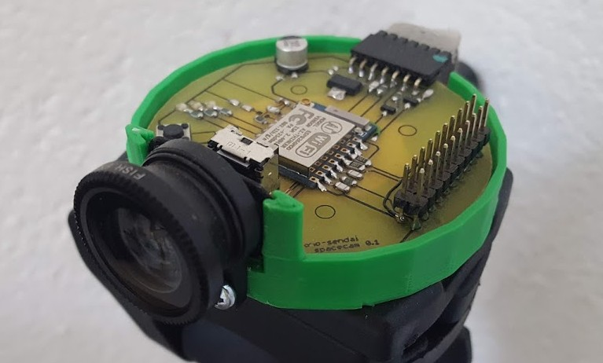
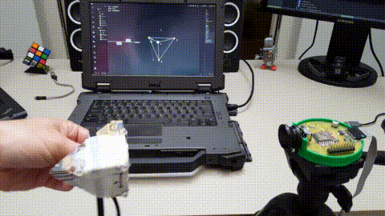
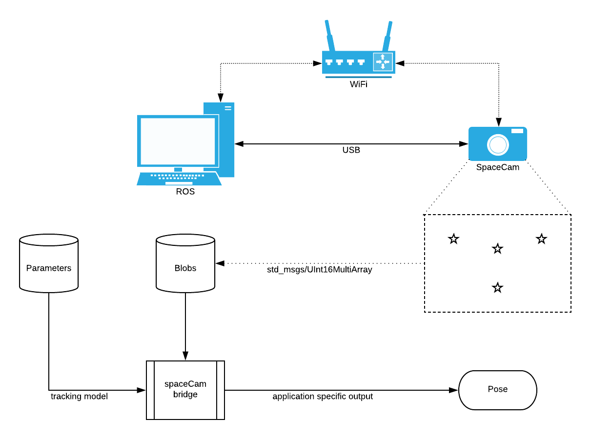

# SpaceCam #
### Opensource High Speed IR Tracking over WiFi

Various robotic and VR research and development projects require a reliable ground truth pose estimate, that is best to obtain visually. **SpaceCam** is an open source project, built on easily available components such as ESP8266 or the Pixart I2C camera module. The repositories contain all hardware design files necessary to build one, the source code for the firmware and bridge application for ROS. Also there is a Gazebo plugin to run simulations without the actual sensor.

### Capabilities
* Tracks 4 IR light sources simultaneously
* 1024x768 resolution
* 100Hz sample rate
* WiFi AP or WiFi client mode or direct USB connection
* Embedded web server for easy configuration
* ROS compatibility

### Use cases
* 2D/3D odometry benchmarking - *geometry_msgs::PoseWithCovariance*
* 2D tracking of single point oscillations - *for example angular velocity of a marker on a wheel for automated PID tuning*
* 3D optical head pose estimation - *for virtual reality headsets or desktop applications*
* 3D IMU benchmarking and covariance measurements - *sensor_msgs::Imu*
* 3D sensor fusion benchmarking and covariance measurements
* Input device for interactive projections - *IR light pen*
* Inverse AR/VR tracking - *Ground markers*

### ROS integration

### How to get started
1. Get the [hardware design files](https://github.com/nilseuropa/spacecam_hardware) and build one.
2. Get the [firmware source](https://github.com/nilseuropa/spacecam_firmware), compile and upload it to the board.
3. Use the raw output or the [ROS bridge](https://github.com/nilseuropa/spacecam_ros_bridge) to start tinkering with it.

The Gazebo plugin is available [here](https://github.com/nilseuropa/spacecam_gazebo_plugin).

### To Do
* find the design files on one of my computers for WiFi enabled markers
